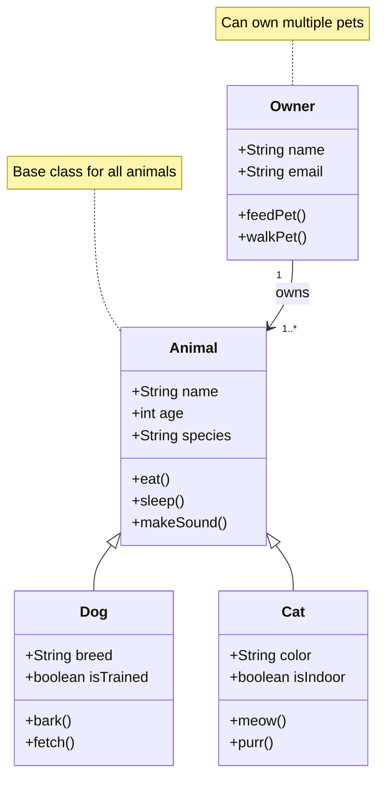

# mermaid-demo

Some Readme text
about something..

<h1> How to use ...</h1>
asdk aslkd jaslkdjasl j
klasjdlkasjkd kasdl kaslaskd jlakj
askldj lsaksd jkasdk jak

<h1> Class Diagram </h1>

```mermaid
classDiagram
    class Animal {
        +String name
        +int age
        +String species
        +eat()
        +sleep()
        +makeSound()
    }
    
    class Dog {
        +String breed
        +boolean isTrained
        +bark()
        +fetch()
    }
    
    class Cat {
        +String color
        +boolean isIndoor
        +meow()
        +purr()
    }
    
    class Owner {
        +String name
        +String email
        +feedPet()
        +walkPet()
    }
    
    Animal <|-- Dog
    Animal <|-- Cat
    Owner "1" --> "1..*" Animal : owns
    
    note for Animal "Base class for all animals"
    note for Owner "Can own multiple pets"
```
