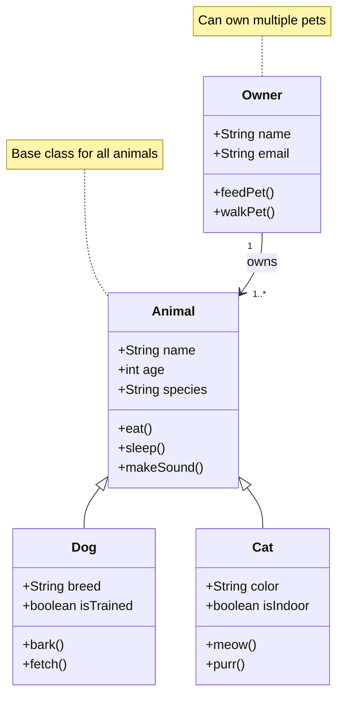

# mermaid-demo

Some Readme text
about something..

<h1> How to use ...</h1>
asdk aslkd jaslkdjasl j
 
klasjdlkasjkd kasdl kaslaskd jlakj
 
askldj lsaksd jkasdk jak
 
asdsad asd asd qwe sad asd
 
asd qwe asd qwe asd qwd asd
 
asd qwe asd qwe sad qwd
 
asd qwe sad qwdadasd

<h1> Class Diagram </h1>

